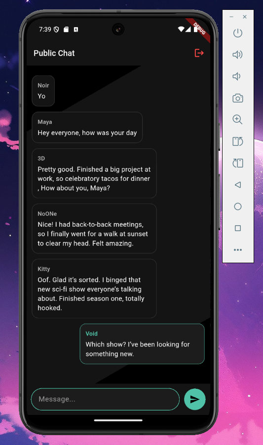

# Public Chat Mobile Application



A real-time public chat mobile application built with Flutter , and Express, TypeORM, and PostgreSQL for the backend API.

## Features

- Real-time chat using Socket.IO
- Temporary user accounts
- REST API backend for message and user management

## Tech Stack

Backend: ExpressJs, TypeScript, TypeORM, class-transformer, Cors, dotenv, pg, reflect-metadata, socket.io, typeorm, zod, Yarn
Database: PostgreSQL
Mobile: Flutter

## Prerequisites

- [Flutter](https://flutter.dev/)
- [Node.js](https://nodejs.org/)
- [Yarn](https://yarnpkg.com/)

## Installation

I. Clone the repository:

```bash
git clone https://github.com/l1l-01/flutter-chat-app.git
cd public-chat
```

- Backend

1. Navigate to the backend folder

   ```bash
   cd server
   ```

2. Create a .env file with the following configuration:

   ```bash
   PORT=3000
   DB_HOST=localhost
   DB_PORT=5432
   DB_USER=<your_db_user>
   DB_PASS=<your_db_password>
   DB_NAME=<your_db_name>
   NODE_ENV=development
   ```

3. Install dependencies:

   ```bash
   yarn install
   ```

4. Build the backend:

   ```bash
   yarn build
   ```

5. Start the application:
   ```bash
   yarn start
   ```

- Mobile App

1. Navigate to the frontend folder

   ```bash
   cd app
   ```

2. Start the application:

   ```bash
   flutter run
   ```

## Project Structure

- `app/`: Mobile app
- `server/`: Backend

## License: MIT

This project is open-source and free to use.
